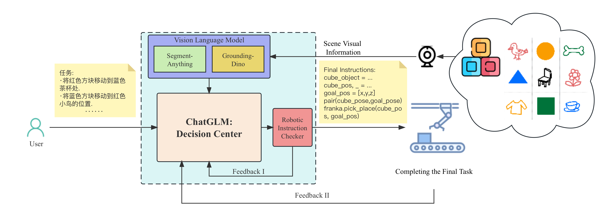
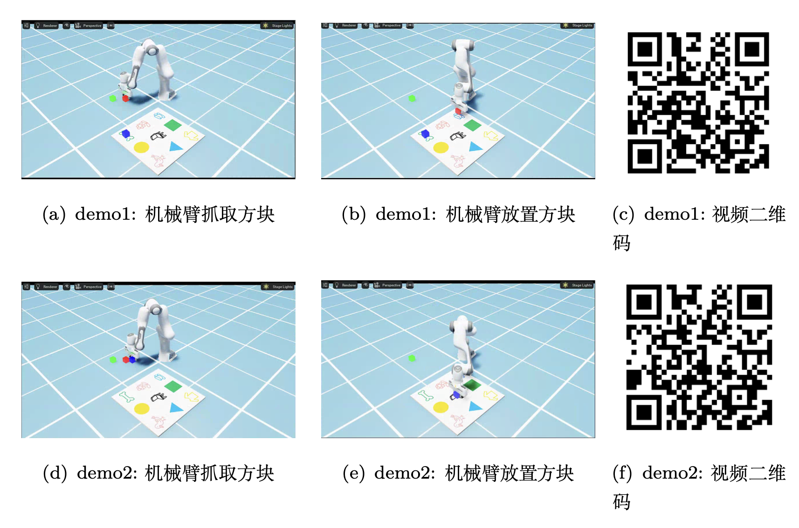

# Cyber Mind:Robotic Control System Based on ChatGLM

### Isaac 仿真部分

环境：Isaac Sim

```bash
cd sim
python app.py
```

### 系统独立测试

#### 1.大语言模型

```bash
cd sim
python chatglm.py
```

#### 2.视觉语言模型

```bash
cd sim
python VLM.py
```

### Pipeline



### Demo



### 文件目录

```bash
cyber-mind
|-- backgroudn_1.png
|-- backgroudn_2.jpg
|-- background_3.jpg
|-- pick_place.py
|-- README.md
|-- camera.py
|-- franka.py
|-- sim
    |-- result
        |-- .gitkeep
        |-- mask.png
        |-- box.png
    |-- vision.py
    |-- cube_manager.py
    |-- chatglm.py
    |-- prompt.txt
    |-- img
        |-- .gitkeep
        |-- test3.png
        |-- test2.png
    |-- VLM.py
    |-- camera.py
    |-- vlm_utils
        |-- service_pb2_grpc.py
        |-- local-client.yaml
        |-- service_pb2.py
        |-- .gitkeep
        |-- config.yaml
        |-- utils.py
        |-- vlm_client.py
        |-- draw.py
    |-- app.py
    |-- franka.py
```

